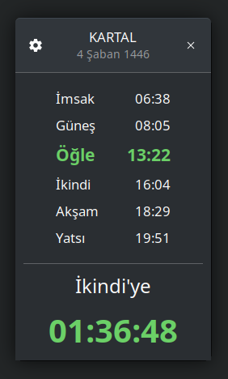
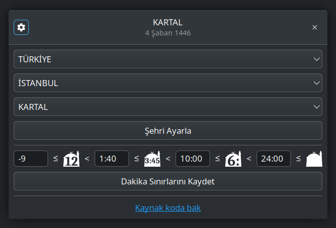

#  Ezan Vakti

Diyanet İşleri Başkanlığı tarafından yayınlanan ezan vakitlerini gösteren bir GTK uygulamasıdır.

## Kurulum

    flatpak install com.cahidenes.EzanVakti

## Özellikler

### Konum Seçimi

### Görev Çubuğu İkonu

Uygulama çalıştırdığında bir sonraki vakte kalan dakika görev çubuğunda ikon olarak gösterilir.

Kalan dakika 3 farklı şekilde gösterilebilir:

#### Dakika Modu: 

Sadece kalan dakika gösterilir. Vaktin üzerinden 9 dakikaya kadar geçmişse - dakika olarak gösterebilir: 

**-9** ile **99 (1:39)** arasındaki değerleri gösterebilir.

#### Saat:Dakika Modu: 

Saat ve dakika birlikte gösterilir. 

**1:00** ile **9:59** arasındaki değerleri gösterebilir.

#### Saat Modu: 

Sadece saat gösterilir. 3:00 ile 3:59 arasındaki değerler 3: olarak gösterilir.

**1:00** ile **23:59** arasındaki değerleri gösterebilir.

> Hangi dakika değerlerinde hangi modun gösterileceği ayarlardan belirlenebilir.
 
https://github.com/eminfedar/vaktisalah-gtk-rs ilham alınarak yapılmıştır.